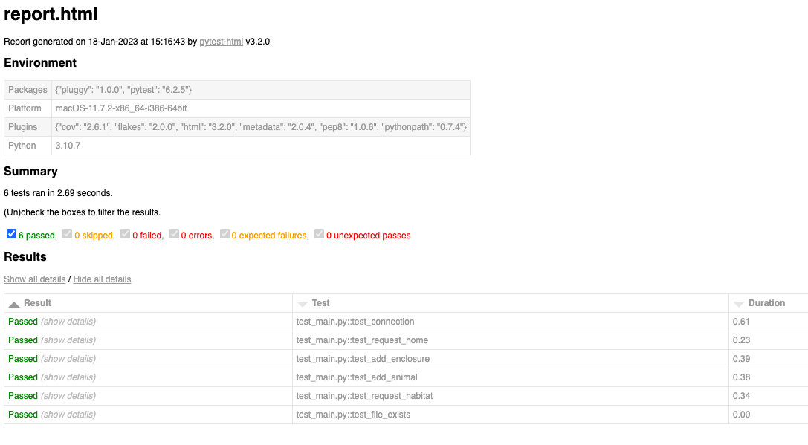
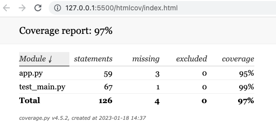
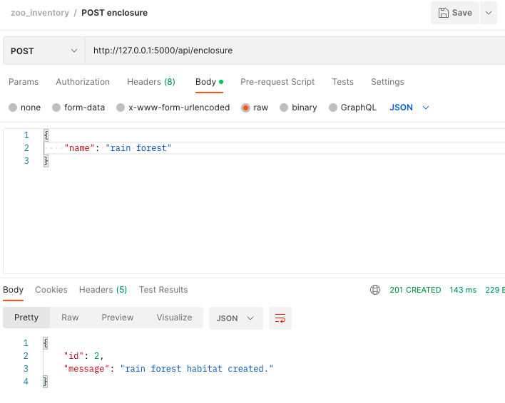
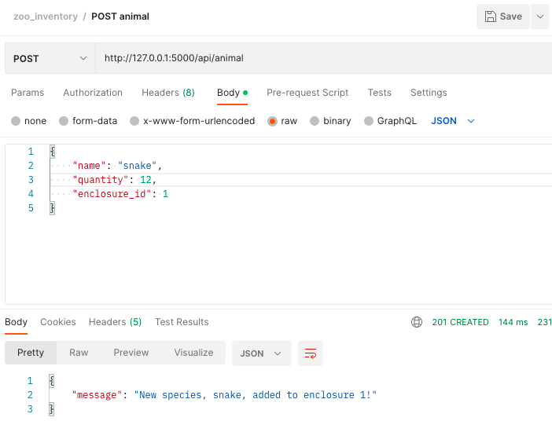
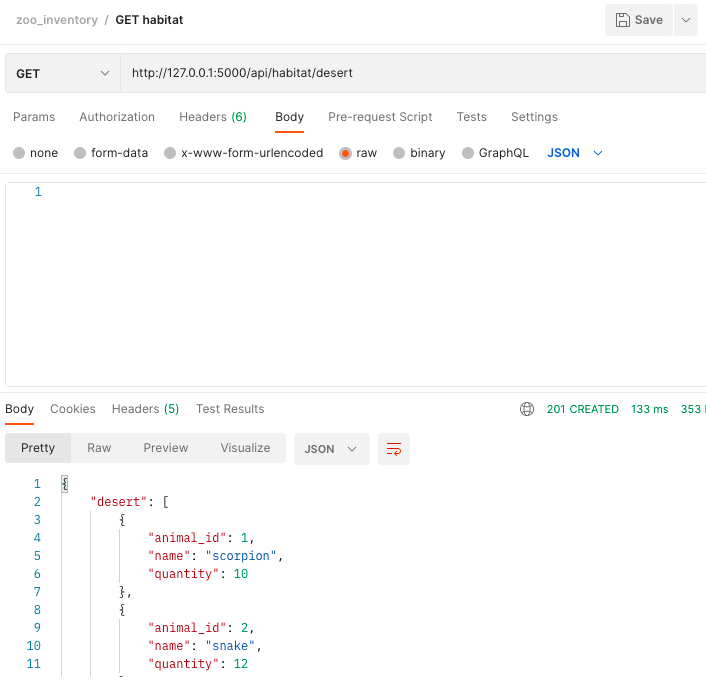

# zoo-inventory

## Description

This is a Test Driven Development project of a RESTful API that mocks a Zoo inventory. We were required to be able to create/post an enclosure, animals, and then given freedom to create our other route(s), where I coded a "get_habitat" route that accesses the data via enclosure name or enclosure id.

As this was TDD, we had to come up with 3 tests to guide our development process, as detailed in my testing_plan.txt file. My tests included multiple pytest fixtures to setup a database connection and to create a Flask App instance, as well as a simpler test to determine that certain files exist. The results yielded 6 pytest tests that are PASSED and are displayed using python-html and a coverage report, shown below:

### Evidence of Functional Routes

